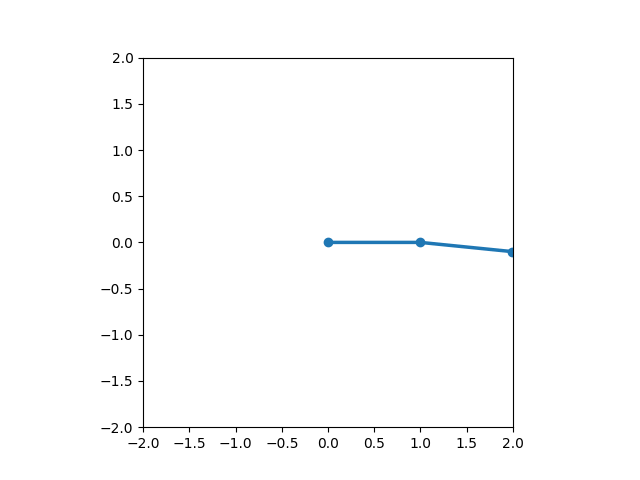

Lagrangian Double Pendulum Simulation
==========================

Overview
--------
This project simulates and animates a double pendulum using physics derived from the Lagrangian (Euler-Lagrange equations). It uses numerical integration (Runge-Kutta 4th order method) to evolve the system over time and generates a visual animation (GIF) of the pendulum's motion.

The system accounts for:
- Nonlinear coupling between pendulum arms
- Gravitational acceleration
- Optional damping (energy loss)
- Realistic physical parameters

The animation is exported to a .gif file and optionally displayed using matplotlib.

Directory Structure
-------------------
- main.py
  - Sets up simulation parameters and runs the full simulation loop

- model/
  - state.py
    - Contains the State class (theta_1, theta_2, v_1, v_2)
  - params.py
    - Defines the Params class (m_1, m_2, l_1, l_2, g, b_1, b_2)
  - dynamics.py
    - Computes angular accelerations using Euler-Lagrange equations

- simulation/
  - integrator.py
    - Implements the RK4 integration step for updating the pendulum state

- visualization/
  - animation.py
    - Creates and saves an animated .gif of the pendulum motion
  - output/
    - pendulum.gif (generated animation file)

Usage
-----
1. Ensure Python 3.8+ and a virtual environment (optional but recommended)
2. Install required packages:
   pip install matplotlib numpy scipy

3. Run the simulation:
   python main.py

4. Output will be saved as:
   visualization/output/pendulum.gif

Tuning Parameters
-----------------
- Modify initial state in `main.py`:
    theta_1, theta_2, v_1, v_2
- Adjust time step `dt` for stability
- Damping coefficients (`b_1`, `b_2`) can be tuned to reduce chaos
- Animation speed can be adjusted in `animation.py` by changing `fps` and `interval`

Physics
-------
- Motion derived from Euler-Lagrange equations
- Lagrangian: L = T - V (kinetic - potential energy)
- Nonlinear 2x2 coupled second-order ODE system
- RK4 integration over time
- Supports damping for realistic energy decay

Troubleshooting
---------------
- If animation appears too fast: lower `fps` or subsample `history`
- If pendulum behaves unrealistically:
    - Clamp velocities
    - Use smaller initial angles
    - Increase damping slightly
- If gif doesn't play: open in a browser (e.g., Safari or Chrome)

Credits
-------
Created by Connor Buckley

License
-------
MIT License
